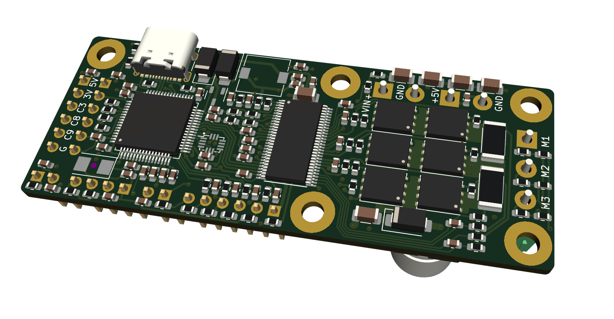

Custom E-bike controller based on VESC 4.10
===========================================

Customized version of [Benjamin Vedder's VESC](https://github.com/vedderb/bldc-hardware) for driving BLDC motors.

VESC Hardware is licensed under the Creative Commons Attribution-ShareAlike 4.0 International License. To view a copy of this license, visit http://creativecommons.org/licenses/by-sa/4.0/.

Can use either VESC firmware or my [custom firmware](https://github.com/PetteriAimonen/ebike-controller/).

Changes:

* Added screw terminals for power cables and 2.54 mm pin headers for signals.
* Most parts are on single-side, with parts available on JLCPCB.
* Added LSM6DS3 accelerometer on board for controlling assist power
* Designed for max. 20A 50V operation.

[Schematic](design/images/BLDC_4.pdf)

Designed to mount on an aluminum block for cooling the FETs.
Alternatively a heatsink can be screwed on.

Assembly costs for 5 pcs at JLCPCB as of 2023:

    PCB (with 1 oz inner layer copper and lead-free HASL): $28.00
    Setup fee:$7.88
    Stencil:$1.48
    Components:$97.77
    Extended components fee:$29.56
    SMT Assembly:$3.43 

